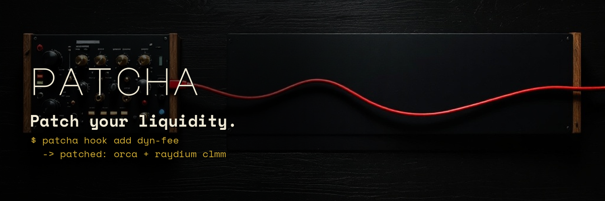
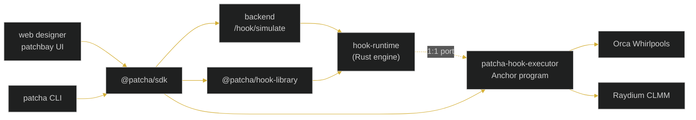

# Patcha

**Patch your liquidity.** Compose hooks like patching modules, then run them on
Solana CLMMs.

[](https://patcha.fi)
[](docs/architecture.md)
[](https://x.com/patcha_fi)
[](https://github.com/patcha-fi/patcha/actions/workflows/ci.yml)
[](LICENSE)
[](https://github.com/patcha-fi/patcha/stargazers)
[](crates)
[](packages)
[](programs)
[](programs/patcha-hook-executor)

`6/6 hooks · 41/41 tests · Orca + Raydium · Anchor 0.31 · mainnet-ready`

---

## The hook problem

Uniswap v4 made the AMM programmable: a pool can call out to a *hook* contract
at fixed points in its lifecycle — before and after initialize, add/remove
liquidity, swap, and donate — so liquidity providers can attach custom logic
(dynamic fees, gating, limit orders, MEV defenses) without forking the AMM.

Solana's concentrated-liquidity AMMs — Orca Whirlpools and Raydium CLMM — do not
expose that extension point. They do not call arbitrary programs on the swap
path, so the v4 pattern does not transfer directly.

Patcha brings the same idea to Solana from the **integration boundary**. A
router program or an off-chain keeper observes a pool lifecycle event, maps it
into a venue-neutral context, and calls the Patcha executor. Hooks decide
allow / deny / fee-override; a veto in a `before*` callback reverts the
transaction.

## How a hook evaluates

```rust
use patcha_hook_runtime::{builtin::DynamicFee, Hook, HookCallback, HookContext, Dex};

let fee_hook = DynamicFee::default();           // base 30 bps, max 100 bps
let mut ctx = HookContext::new(HookCallback::BeforeSwap, Dex::OrcaWhirlpool, [0u8; 32]);
ctx.amount_in = 500_000_000;                    // 0.5 SOL-equivalent

let decision = fee_hook.evaluate(&ctx);
assert!(decision.allow);
assert_eq!(decision.fee_override_bps, Some(65)); // interpolated toward the cap
```

The exact same arithmetic is ported into the Anchor program, so a backtest in
the backend and a trigger on-chain return the same fee.

## Six built-in modules

Each module is a patch cable color in the designer; the slug is the stable
identifier shared by the runtime, the program, the SDK, and the CLI.

| Module | Slug | Category | Callbacks | What it does |
| --- | --- | --- | --- | --- |
| Dynamic Fee | `dynamic-fee` | fees | beforeSwap, afterSwap | Ramps the fee from a base to a cap using swap size as a volatility proxy |
| TimeLock | `time-lock` | timing | beforeAddLiquidity, beforeRemoveLiquidity | Blocks liquidity actions until an unlock timestamp |
| WhitelistGate | `whitelist-gate` | gating | beforeSwap, beforeAddLiquidity | Restricts actions to an allowlist (Merkle root committed on-chain) |
| RangeOrder | `range-order` | range | afterSwap | Fills a one-sided order as the tick crosses a target |
| AntiMEV | `anti-mev` | mev | beforeSwap, afterSwap | Vetoes swaps that move price past a per-block cap; credits prevented MEV |
| KYCGate | `kyc-gate` | kyc | beforeSwap, beforeAddLiquidity | Requires a verified-credential attestation before acting |

Folding rules when several hooks share a callback: hooks run in install order,
the first veto short-circuits, the last fee override wins, and credited MEV
accumulates.

## Architecture



The decision logic lives once as toolchain-free Rust (`crates/hook-runtime`) and
is ported 1:1 into the Anchor program. The metadata (slugs, params, cable
colors) lives once in `@patcha/hook-library` and is read by every other layer,
so the web designer, SDK, CLI, runtime, and program never drift.
