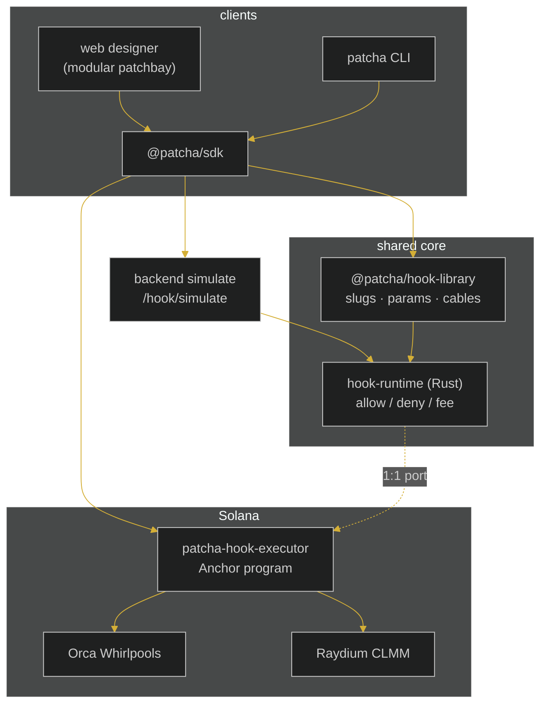

# Architecture

Patcha is a hook framework for Solana concentrated-liquidity market makers
(CLMMs). It mirrors the Uniswap v4 hook model — custom logic patched onto the
lifecycle of a pool — and adapts it to Orca Whirlpools and Raydium CLMM, which
do not call arbitrary programs on their swap path.

## Layers



## Why a trigger boundary

Uniswap v4 encodes hook permissions in the hook contract address and the pool
manager calls the hook directly. Solana CLMMs do not expose that extension
point, so Patcha is driven at the **integration boundary**: a router program or
an off-chain keeper observes a pool lifecycle event (swap, add/remove
liquidity), maps it into a venue-neutral `HookContext`, and calls
`trigger_hook`. A veto in a `before*` callback reverts the transaction.

## Decision parity

The same hook arithmetic exists twice:

- `crates/hook-runtime` — toolchain-free std Rust, used by the backend
  simulator and by unit tests. No Solana dependency, so it tests in
  milliseconds.
- `programs/patcha-hook-executor/src/hooks` — a 1:1 port that decodes params
  from a borsh blob in the `Params` PDA.

Because the slugs, parameter layouts, and arithmetic are identical, a backtest
in the backend and a trigger on-chain produce the same allow/deny/fee decision.

## PDA layout

| PDA | Seeds | Holds |
| --- | --- | --- |
| registry | `["hook_registry"]` | admin, hook count, install count |
| hook meta | `["hook", slug]` | kind, code hash, author, audited flag |
| installation | `["installation", pool, slug]` | pool, installer, dex, active flag |
| params | `["params", installation]` | borsh-encoded hook params |

## Repository layout

```
patcha/
├── crates/
│   ├── hook-runtime/     toolchain-free engine (callbacks, registry, builtins)
│   └── hook-adapters/    Orca / Raydium event -> HookContext mappers
├── programs/
│   └── patcha-hook-executor/   Anchor program (registry + install + trigger)
├── packages/
│   ├── hook-library/     cross-language metadata (slugs, params, cables)
│   └── ts-sdk/           PDA derivation + params encoders + simulate client
└── docs/
```
